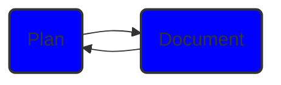
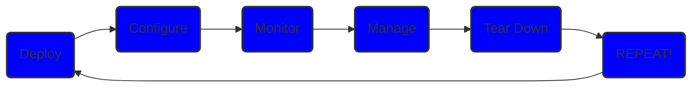

# Some of I(C)T is about ...hmmm... :thinking: ...staying healthy...

#### - Utilizing Infrastructure as Code (IaC) https://en.wikipedia.org/wiki/Infrastructure_as_code

Continuously planning, documenting...

...deploying, configuring, monitoring, managing (also tearing down) highly available ICT infrastructure with open source tools.

#### - Homelab
 - I'll be going through basic aspects that should be considered when creating homelab ICT infrastructure. 
 - Documentation of all this will be available later on website currently under development.
 - I will also create documentation for website creation process.
#### - Cyber security

#### - Sofware development

### Keep exploring! - /ˈsloʊ.li/ 
